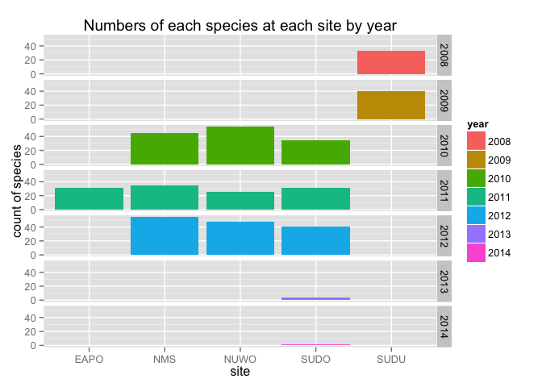
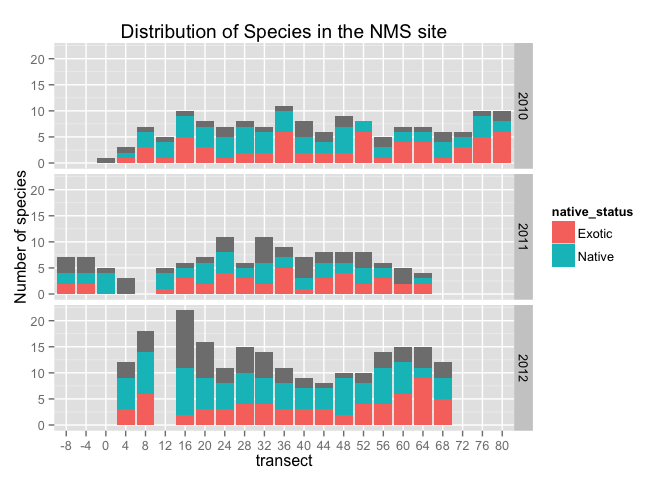
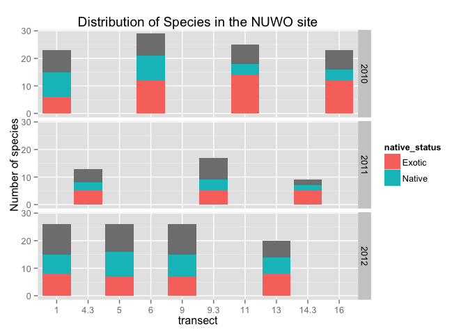
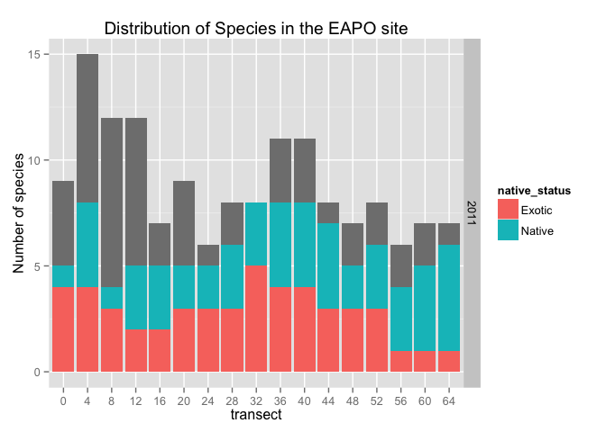
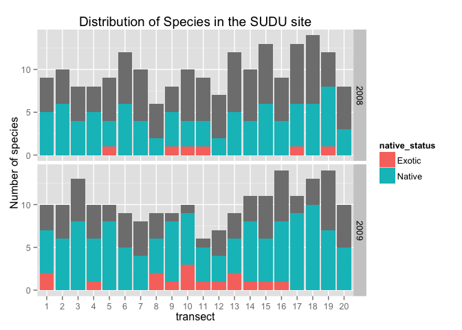
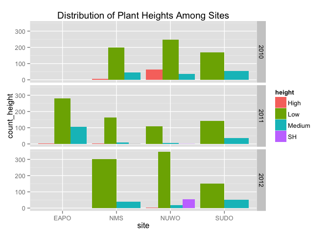

``` r
library(dplyr)
```

    ## 
    ## Attaching package: 'dplyr'
    ## 
    ## The following objects are masked from 'package:stats':
    ## 
    ##     filter, lag
    ## 
    ## The following objects are masked from 'package:base':
    ## 
    ##     intersect, setdiff, setequal, union

``` r
library(ggplot2)
library(tidyr)
plant_data <- read.csv("cleaned_landsend_veg_2007_2012.csv", na.strings = c(""))
head(plant_data)
```

    ##   site_year_code transect point height              species native_status
    ## 1      NUWO-2012        5    90    Low                 <NA>          <NA>
    ## 2      NUWO-2012       13   150    Low                 <NA>          <NA>
    ## 3       NMS-2010        8    20    Low Achillea millefolium        Native
    ## 4       NMS-2010       24     4    Low Achillea millefolium        Native
    ## 5       NMS-2010       48    16    Low Achillea millefolium        Native
    ## 6       NMS-2010       60    16    Low Achillea millefolium        Native
    ##   life_history plant_code stature
    ## 1         <NA>       <NA>    <NA>
    ## 2         <NA>       <NA>    <NA>
    ## 3    Perennial       ACMI    Forb
    ## 4    Perennial       ACMI    Forb
    ## 5    Perennial       ACMI    Forb
    ## 6    Perennial       ACMI    Forb

``` r
plant_data <- separate(plant_data, site_year_code, into = c("site", "year"))


# covnert transect, point to factor
plant_data <- plant_data %>% 
    mutate(transect = as.factor(transect),
           point = as.factor(point),
           species = tolower(species))


# recode incomplete variables
plant_data$height[plant_data$height == "L"] <- "Low"
plant_data$height[plant_data$height == "L "] <- "Low"
plant_data$height[plant_data$height == "M"] <- "Medium"
plant_data$height[plant_data$height == "H"] <- "High"
plant_data <- droplevels(plant_data)

by_transect <- plant_data %>% group_by(transect) %>%
                summarise(count_species = n_distinct(species)) %>%
                arrange(desc(count_species))


head(by_transect, 20)
```

    ## Source: local data frame [20 x 2]
    ## 
    ##    transect count_species
    ## 1        16            58
    ## 2         6            48
    ## 3         1            44
    ## 4         5            39
    ## 5         8            39
    ## 6        36            38
    ## 7        20            37
    ## 8         4            36
    ## 9         9            35
    ## 10       28            34
    ## 11       11            33
    ## 12       12            32
    ## 13       56            32
    ## 14       13            31
    ## 15       60            31
    ## 16       32            30
    ## 17       18            27
    ## 18       48            27
    ## 19       40            26
    ## 20       64            25

``` r
# by site
by_site_year <- plant_data %>% group_by(year, site) %>%
            summarise(count_species = n_distinct(species)) %>%
            arrange(desc(count_species))

ggplot(aes(x = site, y = count_species, fill = year), data = by_site_year) +
    geom_bar(stat="identity") + labs(title = "Numbers of each species at each site by year") + facet_grid(year ~.) + ylab("count of species")
```



``` r
SUDO <- plant_data %>% filter(site == "SUDO") 
SUDO_by_year <- SUDO %>% group_by(year,
                                  life_history) %>% 
    summarise(num_species = n_distinct(species))
```

``` r
by_site_transect <- plant_data %>% group_by(site, transect) %>% 
                    summarise(count = n_distinct(species))

# SUDO site
by_site_transect_SUDO <- plant_data %>% group_by(year,site, transect,native_status) %>% 
                    summarise(count = n_distinct(species)) %>% filter(site == "SUDO") %>% filter(year %in% c("2010", "2011", "2012"))

ggplot(aes(x = transect, y = count, fill = native_status), data = by_site_transect_SUDO) + geom_bar(stat="identity") +
    facet_grid(year ~.) + labs(title = "Distribtuion of Species in the SUDO site") + ylab("Number of species")
```


``` r
# NMS
by_site_transect_NMS <- plant_data %>% group_by(year,site, transect,native_status) %>% 
                    summarise(count = n_distinct(species)) %>% filter(site == "NMS")%>% filter(year %in% c("2010", "2011", "2012"))

ggplot(aes(x = transect, y = count, fill = native_status), data = by_site_transect_NMS) + geom_bar(stat="identity") +
    facet_grid(year ~.) + labs(title = "Distribution of Species in the NMS site") + ylab("Number of species")
```



``` r
# NUWO

by_site_transect_NUWO <- plant_data %>% group_by(year,site, transect,native_status) %>% 
                    summarise(count = n_distinct(species)) %>% filter(site == "NUWO")
ggplot(aes(x = transect, y = count, fill = native_status), data = by_site_transect_NUWO) + geom_bar(stat="identity") +
    facet_grid(year ~.) + labs(title = "Distribution of Species in the NUWO site") + ylab("Number of species")
```



``` r
# EAPO

by_site_transect_NUWO <- plant_data %>% group_by(year,site, transect,native_status) %>% 
                    summarise(count = n_distinct(species)) %>% filter(site == "EAPO")
ggplot(aes(x = transect, y = count, fill = native_status), data = by_site_transect_NUWO) + geom_bar(stat="identity") +
    facet_grid(year ~.) + labs(title = "Distribution of Species in the EAPO site") + ylab("Number of species")
```



``` r
# SUDU

by_site_transect_NUWO <- plant_data %>% group_by(year,site, transect,native_status) %>% 
                    summarise(count = n_distinct(species)) %>% filter(site == "SUDU")
ggplot(aes(x = transect, y = count, fill = native_status), data = by_site_transect_NUWO) + geom_bar(stat="identity") +
    facet_grid(year ~.) + labs(title = "Distribution of Species in the SUDU site") + ylab("Number of species")
```



``` r
by_species <- plant_data %>% group_by(plant_code, species) %>% summarise(count = n())


by_site_height <- plant_data %>% group_by(year, site, height) %>% 
    summarise(count_height = n()) %>% filter(year %in% c("2010", "2011", "2012"))

ggplot(aes(site, y = count_height, fill = height), data = by_site_height) + 
    geom_bar(stat = "identity", position = "dodge") + facet_grid(year ~ .) + labs(title = "Distribution of Plant Heights Among Sites")
```


